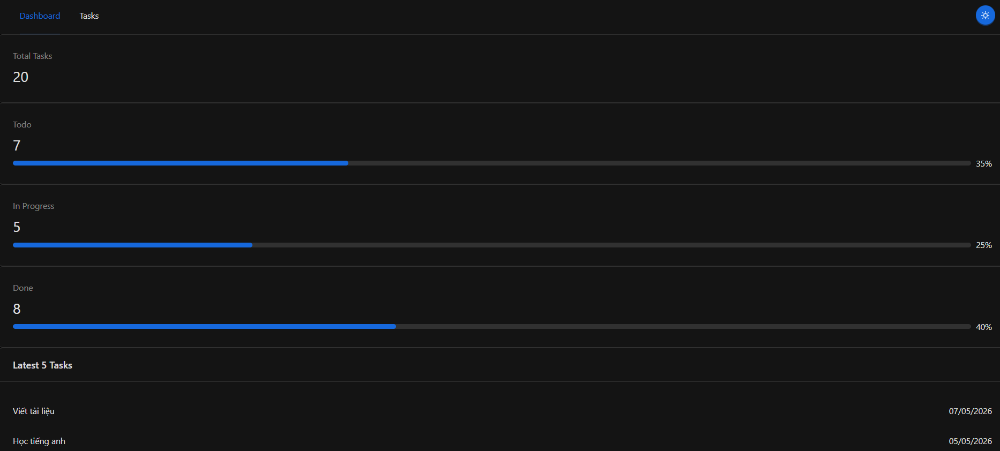
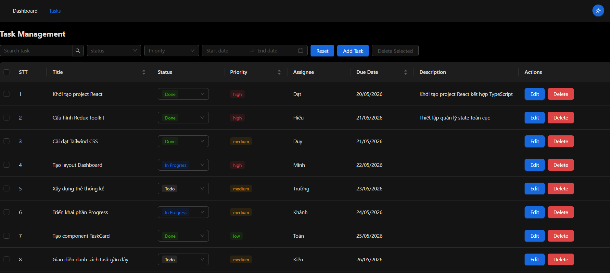
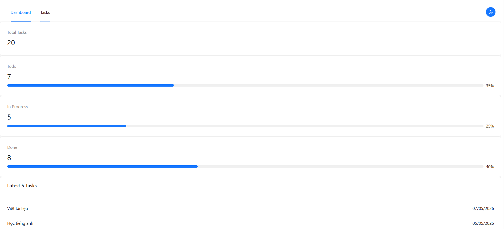
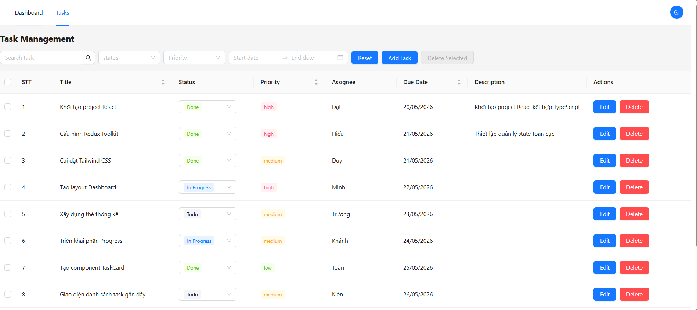
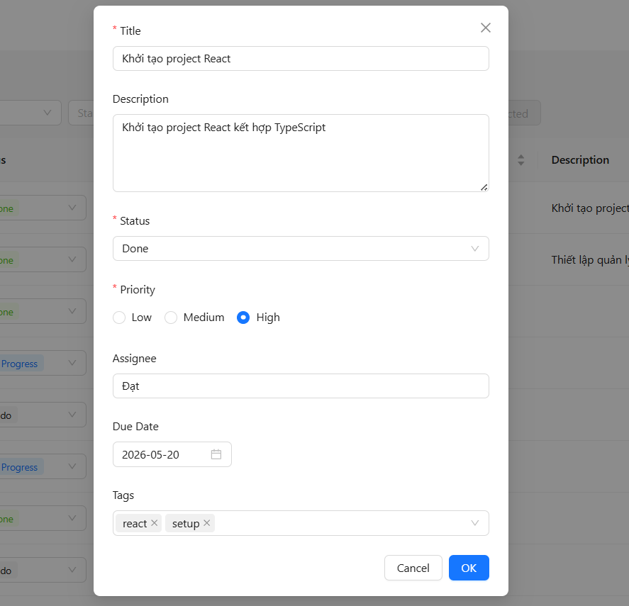
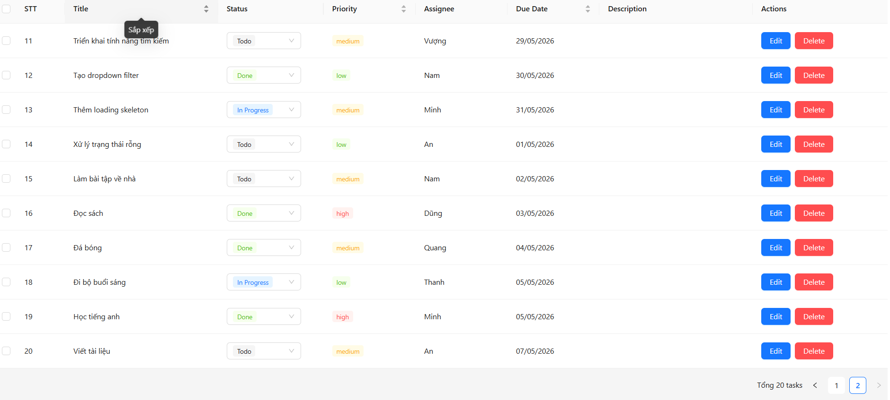

1. Clone project:  git clone https://github.com/NXMinh2k2/fe-test-Nguyen-Xuan-Minh.git
2. Cài dependencies: npm install
3. Chạy project: npm run dev
4. Test: npm run test

- Tech Stack:
React 18
TypeScript 5
Redux Toolkit 2
Ant Design 5
Tailwind CSS 3
React Router DOM
Dayjs

- Tính năng đã làm
Dashboard:
Thống kê tổng số task
Số lượng theo trạng thái:
Todo
In Progress
Done
Hiển thị task mới nhất
Progress theo trạng thái

Task Management:

Hiển thị danh sách task bằng Table
Phân trang (10 items/trang)
Sort theo:
Title
Due Date
Priority

CRUD Task
Thêm task mới (Modal form)
Chỉnh sửa task
Xoá task đơn lẻ
Xoá nhiều task (bulk delete)
Confirm trước khi xoá
Inline Update
Cập nhật trạng thái trực tiếp trong table (Select inline)

Search & Filter:
Search theo tiêu đề (debounce 300ms)
Filter theo:
Status (multi-select)
Priority
Due date range
Reset toàn bộ filter
State Management
Redux Toolkit store
Selector tối ưu với createSelector
Tách logic filter vào Redux (không filter ở UI)

Dark Mode

Custom hook: useTaskFilters
Component tái sử dụng:
TaskModal
StatusSelect
PriorityTag

Testing 
Unit test selector
Unit test component

  

  

  

  

  

  

  

